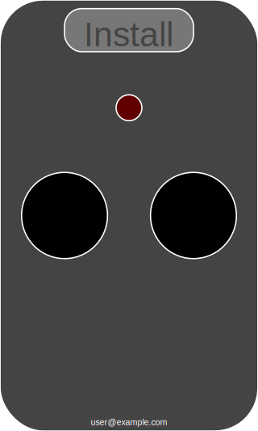

# Gate.io — zdalne sterowanie bramą (Node.js + Socket.IO + Arduino)

Lekka aplikacja webowa do zdalnego sterowania bramą. Frontend (PWA) łączy się z serwerem przez Socket.IO, a serwer rozgłasza polecenia do urządzeń (ESP8266/ESP32) po WebSocket. ESP32 (GSM SIM800) realizuje fizyczne „zadzwonienie” do bramy, a ESP8266 może sterować otwarciem poprzez lokalny endpoint HTTP wystawiany przez ESP32 (mDNS `gategsm`). Dostęp do interfejsu użytkownika jest zabezpieczony logowaniem Google OAuth i listą dozwolonych kont e‑mail.




## Funkcjonalności
- Interfejs WWW z PWA i trybem instalacji na ekranie startowym.
- Logowanie przez Google OAuth 2.0 + biała lista użytkowników.
- Komunikacja w czasie rzeczywistym (Socket.IO dla przeglądarki, WebSocket dla urządzeń).
- Dwa warianty sprzętowe:
  - ESP32 + SIM800 (HTTP + GSM: /open, /status, mDNS `gategsm`).  
  - ESP8266 (klient WS do serwera; wyzwala HTTP do `gategsm`).
- HTTPS z automatycznym przekierowaniem z HTTP.
- Prosty podgląd statusu (LED/log) i heartbeat urządzenia.


## Architektura i porty
- `bin/www.js` uruchamia trzy serwery:
  - HTTP `:80` – tylko przekierowanie 301 do HTTPS.
  - HTTPS `:443` – aplikacja Express + namespace Socket.IO `/gate` dla frontendu.
  - WS `:81` – czysty WebSocket dla urządzeń (protokół `arduino`, Basic Auth).
- Przepływ zdarzeń: UI → Socket.IO → Serwer → WS broadcast → Urządzenie → (HTTP do ESP32/GSM) → odpowiedź → UI.


## Wymagania
- Node.js ≥ 12 (zalecane 14/16) i `npm`.
- Certyfikat i klucz SSL (`sslcert/server.crt`, `sslcert/server.key`).
- Konfiguracja Google OAuth 2.0 (ID klienta, sekret, redirect URL).
- Opcjonalnie: płytki ESP8266/ESP32 do sterowania bramą.


## Szybki start (lokalnie)
1. Sklonuj repo i zainstaluj zależności:
   ```bash
   npm install
   ```
2. Skonfiguruj plik aplikacji:
   ```bash
   cp config.json.example config.json
   # uzupełnij: google.clientID, google.clientSecret, session.keys, users[], arduino{user:pass}
   ```
3. Dodaj certyfikaty TLS:
   ```bash
   cp sslcert/server.crt.example sslcert/server.crt
   cp sslcert/server.key.example sslcert/server.key
   # lub wygeneruj samopodpisany certyfikat (tylko do testów):
   # openssl req -x509 -nodes -days 365 -newkey rsa:2048 \
   #   -keyout sslcert/server.key -out sslcert/server.crt -subj "/CN=localhost"
   ```
4. Uruchom serwer:
   ```bash
   npm start
   ```
   Uwaga: porty `80/443/81` wymagają uprawnień roota albo nadania uprawnień binarce Node:
   ```bash
   sudo setcap 'cap_net_bind_service=+ep' "$(command -v node)"
   ```
5. Otwórz w przeglądarce: `https://<host>/gate` i zaloguj się kontem z listy `users`.


## Konfiguracja aplikacji (`config.json`)
- `javascript.version` – numer do odświeżania assetów w przeglądarce.
- `google.clientID/clientSecret` – dane z Google Cloud Console.
  - Redirect URI: `https://<host>/gate/auth/google/callback`.
- `session` – konfiguracja `cookie-session` (zmień `keys`).
- `users[]` – lista dozwolonych adresów e‑mail (musi się zgadzać z danymi z Google).
- `arduino` – mapa login→hasło dla Basic Auth urządzeń łączących się na WS `:81`.


## Endpoints i zdarzenia
- HTTP(S):
  - `GET /` – strona testowa.
  - `GET /gate` – interfejs pilota; wymaga zalogowania.
  - `GET /gate/open` – wyzwolenie otwarcia (tylko dla zalogowanych; rozgłasza WS).
- Socket.IO (`/gate`):
  - Serwer → klient: statusy `OPEN_GATE_START_REQUEST/RESPONSE`, `OPEN_GATE_END_REQUEST/RESPONSE`,
    `GATE_CONNECTED/DISCONNECTED`, `GATE_HEARTBEAT`.
  - Klient → serwer: `gate` z `{ pressing: true|false }`.
- WebSocket urządzenia (`:81`, protokół `arduino`):
  - Autoryzacja Basic Auth – pary login/hasło z `config.json.arduino`.
  - Broadcast: `OPEN_GATE_START_REQUEST`, `OPEN_GATE_END_REQUEST`.
  - Odpowiedzi urządzeń: `OPEN_GATE_START_RESPONSE`, `OPEN_GATE_END_RESPONSE`, heartbeat `2`.


## Frontend (PWA)
- Manifest: `public/manifest.json`, Service Worker: `public/pwabuilder-sw.js`, rejestracja: `public/pwa.js`.
- Interfejs SVG w `views/gate.ejs`, logika w `public/javascripts/*`.
- Uwaga: klient Socket.IO jest oczekiwany pod `/javascripts/socket.io.js`.  
  Jeżeli nie używasz CDN, umieść tam plik klienta zgodny z `socket.io@2.x`,
  albo zaktualizuj `<script>` na `/socket.io/socket.io.js`.


## Urządzenia
### ESP32 (GSM SIM800)
- Pliki: `arduino/ESP32/Gate/*`.
- Skonfiguruj `arduino/ESP32/Gate/config.h.example` i zapisz jako `config.h`:
  - `WIFI_SSID`, `WIFI_PASS`, `HOSTNAME` (np. `gategsm`).
  - `CALL_TARGET` – numer bramy do wybrania; `AUTH1/2` – dozwolone numery oddzwaniające.
  - `OPEN_TIME` – czas po którym następuje rozłączenie.
- Endpoints HTTP na urządzeniu:
  - `GET /open` – rozpoczyna otwieranie (wykonuje połączenie GSM); 200/226.
  - `GET /status` – 226 gdy „w trakcie otwierania”, inaczej 200.
  - mDNS: `http://gategsm/` (lub wg `HOSTNAME`).

### ESP8266
- Pliki: `arduino/ESP8266/Gate/*`.
- Skonfiguruj `config.h.example` → `config.h`:
  - `wifi_ssid`, `wifi_pass` – dostęp do Wi‑Fi.
  - `ws_host`, `ws_port` (domyślnie 81), `ws_user`, `ws_pass` – zgodne z `config.json.arduino`.
- Urządzenie łączy się do serwera WS i na `OPEN_GATE_START_REQUEST` wyzwala HTTP do `http://gategsm/open`,
  a następnie sondowanie `http://gategsm/status` aż do zakończenia.


## Uruchomienie produkcyjne
- Reverse proxy (np. Nginx) jest zalecane do terminacji TLS oraz mapowania portów.
- W repo jest przykład usługi systemd: `start.sh` (sekcja komentarza).  
  Dodaj plik unit, włącz usługę i loguj przez `journalctl -fu gateio.service`.
- Ogranicz dostęp do portu `:81` (firewall/VLAN) wyłącznie dla zaufanych urządzeń.


## Rozwiązywanie problemów
- Brak klienta Socket.IO w przeglądarce: dostarcz `/public/javascripts/socket.io.js`
  lub zmień ścieżkę na `/socket.io/socket.io.js`.
- Porty 80/443 niedostępne: uruchom z uprawnieniami lub zmień porty w `bin/www.js`.
- 403 przy `/gate`: konto nie jest na białej liście `users[]`.
- Certyfikaty: upewnij się, że ścieżki i uprawnienia do `sslcert/*` są prawidłowe.


## Struktura katalogów (skrót)
- `bin/www.js` – uruchamianie serwerów HTTP/HTTPS/WS i spięcie modułów.
- `app.js` – konfiguracja Express, middleware, trasy.
- `routes/` – trasy (`/`, `/gate`, OAuth itp.).
- `src/io/` – Socket.IO (frontend) – logika zdarzeń.
- `src/socket/` – WebSocket (urządzenia) – uwierzytelnianie i broadcast.
- `views/` – EJS (UI + logowanie + błędy).
- `public/` – statyczne zasoby (JS/CSS/ikony/PWA).
- `arduino/ESP32|ESP8266/` – szkice dla urządzeń.
- `sslcert/` – certyfikat i klucz (w repo wyłącznie przykłady).
